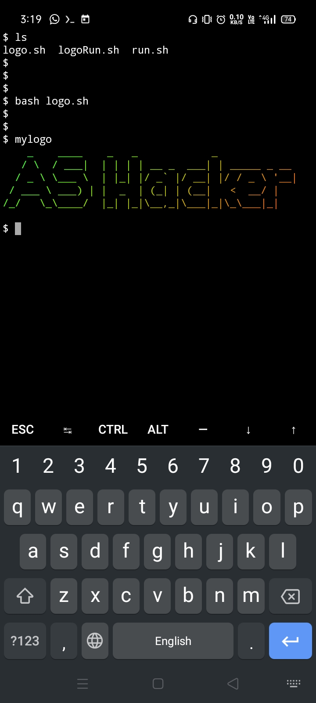

# ASHacker1
## My logo setup in shortcut command

First of all
 Edit this file for your accordingly
rename logo name As Hacker to " your name "

after that type this command
bash "file name.sh"

After that type command 
"mylogo"

